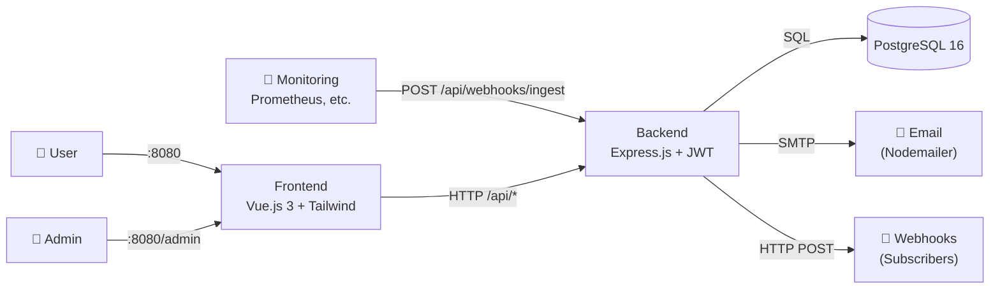
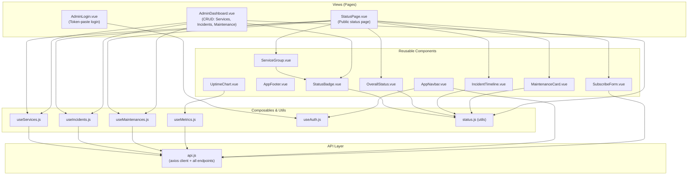
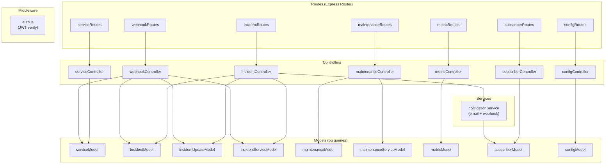
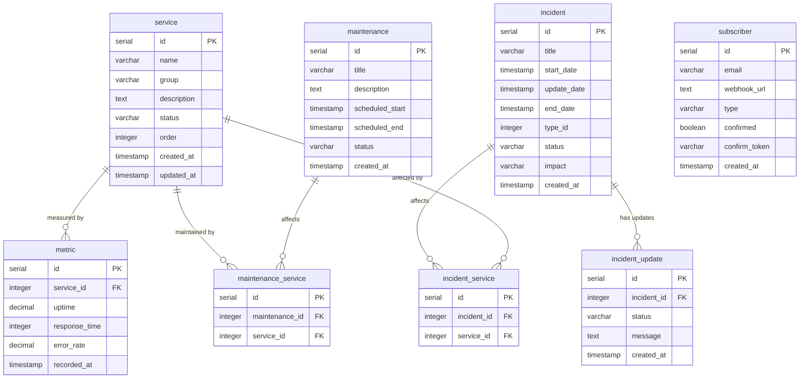
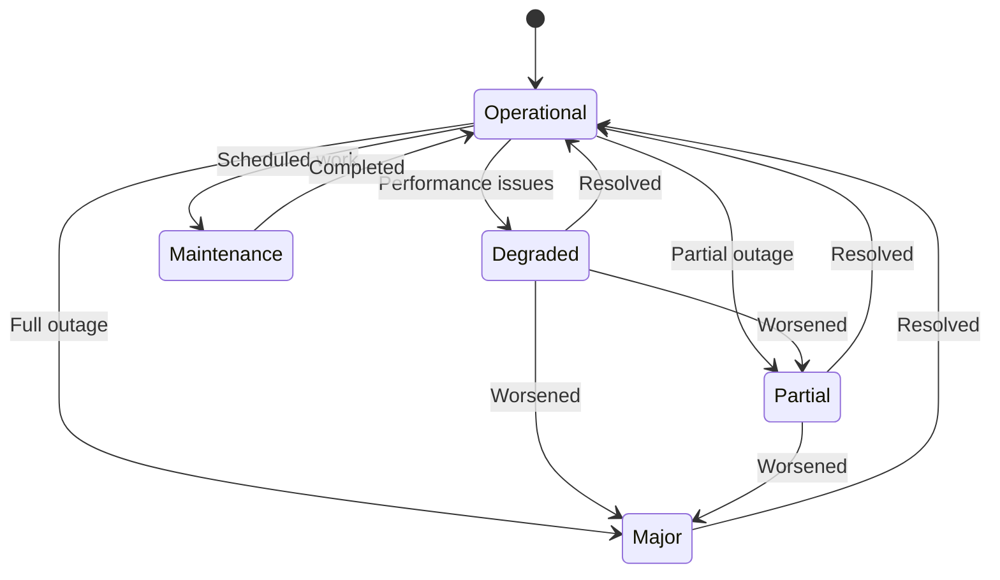
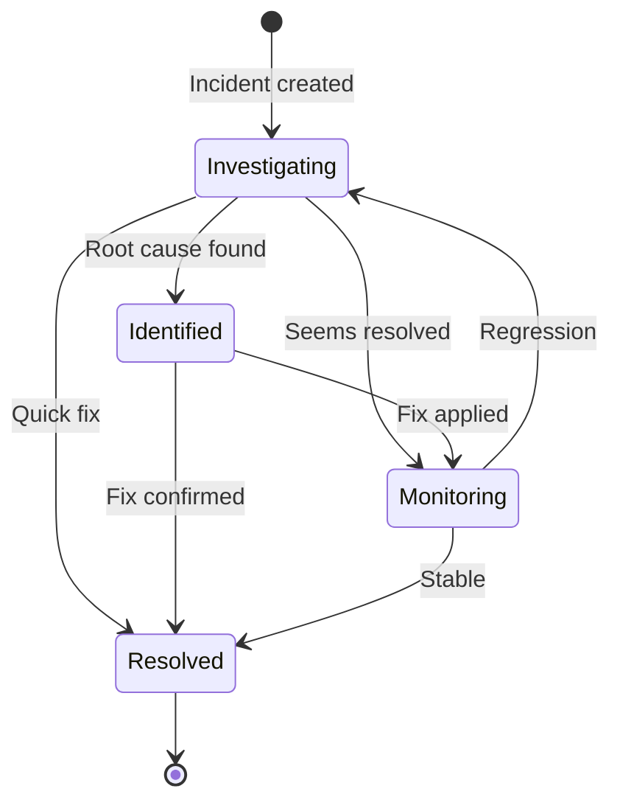

# ServPulse Architecture

## System Overview

```mermaid
flowchart LR
    U["👤 User"] -->|":8080"| FE["Frontend\nVue.js 3 + Tailwind"]
    A["🔧 Admin"] -->|":8080/admin"| FE
    M["📡 Monitoring\nPrometheus, etc."] -->|"POST /api/webhooks/ingest"| BE

    FE -->|"HTTP /api/*"| BE["Backend\nExpress.js + JWT"]
    BE -->|"SQL"| DB[("PostgreSQL 16")]
    BE -->|"SMTP"| EMAIL["📧 Email\n(Nodemailer)"]
    BE -->|"HTTP POST"| WH["🔗 Webhooks\n(Subscribers)"]
```

## Frontend Component Architecture

```mermaid
flowchart TB
    subgraph Views["Views (Pages)"]
        SP["StatusPage.vue\n(Public status page)"]
        AL["AdminLogin.vue\n(Token-paste login)"]
        AD["AdminDashboard.vue\n(CRUD: Services, Incidents, Maintenance)"]
    end

    subgraph Components["Reusable Components"]
        AN["AppNavbar.vue"]
        AF["AppFooter.vue"]
        OS["OverallStatus.vue"]
        SG["ServiceGroup.vue"]
        SB["StatusBadge.vue"]
        IT["IncidentTimeline.vue"]
        MC["MaintenanceCard.vue"]
        UC["UptimeChart.vue"]
        SF["SubscribeForm.vue"]
    end

    subgraph Logic["Composables & Utils"]
        US["useServices.js"]
        UI["useIncidents.js"]
        UM["useMaintenances.js"]
        UMT["useMetrics.js"]
        UA["useAuth.js"]
        ST["status.js (utils)"]
    end

    subgraph API["API Layer"]
        AC["api.js\n(axios client + all endpoints)"]
    end

    SP --> OS
    SP --> SG
    SP --> IT
    SP --> MC
    SP --> SF
    SG --> SB
    AD --> SB

    SP --> US
    SP --> UI
    SP --> UM
    AD --> US
    AD --> UI
    AD --> UM
    AL --> UA
    AN --> UA
    UC --> UMT

    US --> AC
    UI --> AC
    UM --> AC
    UMT --> AC
    AN --> AC
    SF --> AC

    SB --> ST
    OS --> ST
    IT --> ST
    MC --> ST
    AD --> ST
```

## Backend Architecture

```mermaid
flowchart TB
    subgraph Routes["Routes (Express Router)"]
        SR["serviceRoutes"]
        IR["incidentRoutes"]
        MR["maintenanceRoutes"]
        CR["configRoutes"]
        MTR["metricRoutes"]
        SUB["subscriberRoutes"]
        WH["webhookRoutes"]
    end

    subgraph Controllers["Controllers"]
        SC["serviceController"]
        IC["incidentController"]
        MC["maintenanceController"]
        CC["configController"]
        MTC["metricController"]
        SBC["subscriberController"]
        WHC["webhookController"]
    end

    subgraph Models["Models (pg queries)"]
        SM["serviceModel"]
        IM["incidentModel"]
        IUM["incidentUpdateModel"]
        ISM["incidentServiceModel"]
        MM["maintenanceModel"]
        MSM["maintenanceServiceModel"]
        MTM["metricModel"]
        SBM["subscriberModel"]
        CFM["configModel"]
    end

    subgraph Services["Services"]
        NS["notificationService\n(email + webhook)"]
    end

    subgraph Middleware["Middleware"]
        AUTH["auth.js\n(JWT verify)"]
    end

    SR --> SC --> SM
    IR --> IC --> IM
    IC --> IUM
    IC --> ISM
    IC --> NS
    MR --> MC --> MM
    MC --> MSM
    CR --> CC --> CFM
    MTR --> MTC --> MTM
    SUB --> SBC --> SBM
    WH --> WHC --> SM
    WHC --> IM
    WHC --> ISM
    WHC --> IUM
    NS --> SBM
```

## Database Schema

```mermaid
erDiagram
    service {
        serial id PK
        varchar name
        varchar group
        text description
        varchar status
        integer order
        timestamp created_at
        timestamp updated_at
    }

    incident {
        serial id PK
        varchar title
        timestamp start_date
        timestamp update_date
        timestamp end_date
        integer type_id
        varchar status
        varchar impact
        timestamp created_at
    }

    incident_update {
        serial id PK
        integer incident_id FK
        varchar status
        text message
        timestamp created_at
    }

    incident_service {
        serial id PK
        integer incident_id FK
        integer service_id FK
    }

    maintenance {
        serial id PK
        varchar title
        text description
        timestamp scheduled_start
        timestamp scheduled_end
        varchar status
        timestamp created_at
    }

    maintenance_service {
        serial id PK
        integer maintenance_id FK
        integer service_id FK
    }

    metric {
        serial id PK
        integer service_id FK
        decimal uptime
        integer response_time
        decimal error_rate
        timestamp recorded_at
    }

    subscriber {
        serial id PK
        varchar email
        text webhook_url
        varchar type
        boolean confirmed
        varchar confirm_token
        timestamp created_at
    }

    incident ||--o{ incident_update : "has updates"
    incident ||--o{ incident_service : "affects"
    service ||--o{ incident_service : "affected by"
    service ||--o{ metric : "measured by"
    service ||--o{ maintenance_service : "maintained by"
    maintenance ||--o{ maintenance_service : "affects"
```

## Status Flow

```mermaid
stateDiagram-v2
    [*] --> Operational

    Operational --> Degraded: Performance issues
    Operational --> Partial: Partial outage
    Operational --> Major: Full outage
    Operational --> Maintenance: Scheduled work

    Degraded --> Operational: Resolved
    Degraded --> Partial: Worsened
    Degraded --> Major: Worsened

    Partial --> Operational: Resolved
    Partial --> Major: Worsened

    Major --> Operational: Resolved

    Maintenance --> Operational: Completed
```

## Incident Lifecycle

```mermaid
stateDiagram-v2
    [*] --> Investigating: Incident created

    Investigating --> Identified: Root cause found
    Investigating --> Monitoring: Seems resolved
    Investigating --> Resolved: Quick fix

    Identified --> Monitoring: Fix applied
    Identified --> Resolved: Fix confirmed

    Monitoring --> Resolved: Stable
    Monitoring --> Investigating: Regression

    Resolved --> [*]
```
